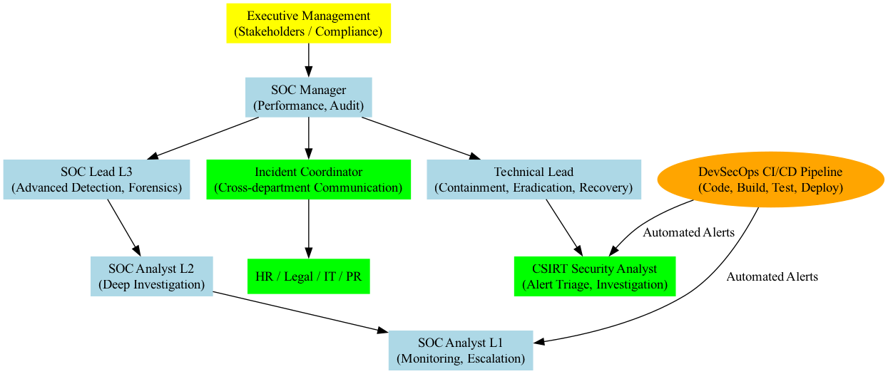

# CSIRT + SOC + DevSecOps Diagram

This diagram represents the hierarchical structure and responsibilities of a CSIRT and SOC team integrated with a DevSecOps pipeline.  

- Executive Management: Stakeholders / Compliance
- SOC Manager: Performance and Audit
- SOC Lead L3: Advanced Detection & Forensics
- Technical Lead: Containment, Eradication, Recovery
- Incident Coordinator: Cross-department Communication
- SOC Analysts L1/L2: Monitoring, Escalation, Deep Investigation
- CSIRT Security Analyst: Alert Triage & Investigation
- CI/CD Pipeline: Integration of automated security alerts

